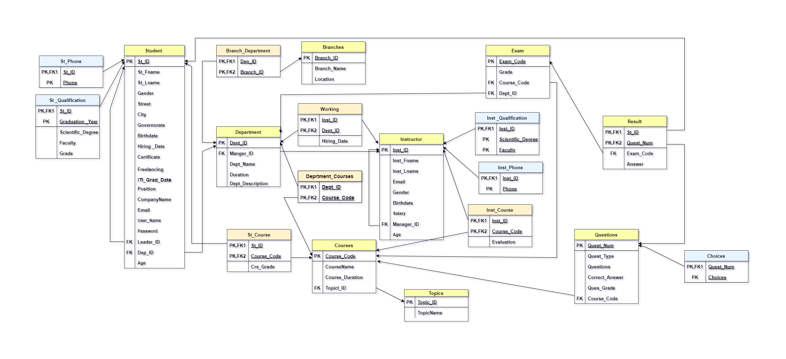

# Examination-System (ITI Graduation Project)
Examination System is designed and developed for students and instructor. The system helps students to take online exam and know their evaluations.  
It also helps instructor to upload the questions and answers in the database, they can see the students who fail or pass the exam.

## Tools
o	Online Website "draw.io" (ER Diagram, Mapping)  
o	SQL Server Management Studio  
o	Redgate, SSIS (Filling data)  
o	SSRS (Reports)  
o	Power BI (Dashboard)  

## Steps
•	ERD  
   
•	Mapping  

    
•	Database Creation  

